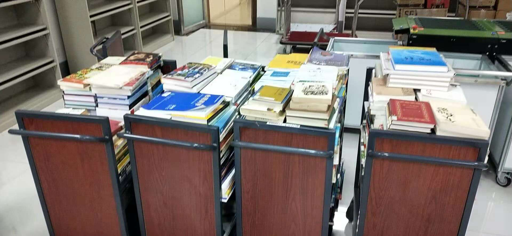

18342021

排序算法——快速排序
-

------------------------------

# [](#header-1)一、引入
-


假设你是一名图书馆助理，面对一整书车的图书，你需要将他们排序后上架，你会怎样排序呢？<br>


我们下意识的做法便是先按字母将图书分类，在对每一个字母类的图书进行排序<br>
其实这种排序方法便是运用了快速排序的思想<br>

# [](#header-1)二、思路
-

# [](#header-3)1.总体思想
-

通过一趟排序将要排序的数据分割成独立的两部分<br>
其中一部分的所有数据都比另外一部分的所有数据都要小<br>
然后再按此方法对这两部分数据分别进行快速排序<br>

# [](#header-3)2.简单表示
-


先任意意选取一个数据（通常选用数组的第一个数）作为**关键数据**<br>
然后将所有比它小的数都放到它前面<br>
所有比它大的数都放到它后面<br>

# [](#header-3)3.排书解释
-

回到刚刚的图书馆排书<br>
我们首先选择了某个字母如`B0/000`作为关键数据<br>
然后将比它小的索书号（即A类书）排在它前面<br>
对其前面的书（A类书进行排序）<br>
对其后面的书可以（以`C0/000`作为关键数据）再运用快速排序的方法，<br>
以此类推便可以把图书快速的分类<br>

# [](#header-1)三、图例
-


# [](#header-1)四、C语言算法
-


```
void sort(int *a, int left, int right)//left,right 指范围
{
    if(left >= right)/*如果左边索引大于或者等于右边的索引就代表已经整理完成一个组了*/
    {
        return ;
    }

    int i = left;
    int j = right;
    int key = a[left];
     
    while(i < j)                               /*控制在当组内寻找一遍*/
    {
        while(i < j && key <= a[j])/*而寻找结束的条件就是，1，找到一个小于或者大于key的数（大于或小于取决于你想升序还是降序）2，没有符合条件1的,并且i与j的大小没有反转*/ 
        {
            j--;/*向前寻找*/
        }
         
        a[i] = a[j];/*找到一个这样的数后就把它赋给前面的被拿走的i的值（如果第一次循环且key是a[left]，那么就是给key）*/
         
        while(i < j && key >= a[i])/*这是i在当组内向前寻找，同上，不过注意与key的大小关系停止循环和上面相反，因为排序思想是把数往两边扔，所以左右两边的数大小与key的关系相反*/
        {
            i++;
        }
         
        a[j] = a[i];
    }
     
    a[i] = key;/*当在当组内找完一遍以后就把中间数key回归*/
    sort(a, left, i - 1);/*最后用同样的方式对分出来的左边的小组进行同上的做法*/
    sort(a, i + 1, right);/*用同样的方式对分出来的右边的小组进行同上的做法*/
                       /*当然最后可能会出现很多分左右，直到每一组的i = j 为止*/
}


```

# [](#header-1)五、实例
-

上面图书馆按字母排书可能体现的不够明显<br>
而当某个字母的书特别多时，便完美的体现了这种思想<br>

# [](#header-5)比如
-

当T类书特别多时<br>
我们便可以选取`T2/001`作为关键数据<br>
比`T2/001`小的索书号全部排在前面，大的在后面<br>
然后在对后面的以`T3/001`作为关键数据快速排序<br>
这样一书车书很快就排好了<br>
