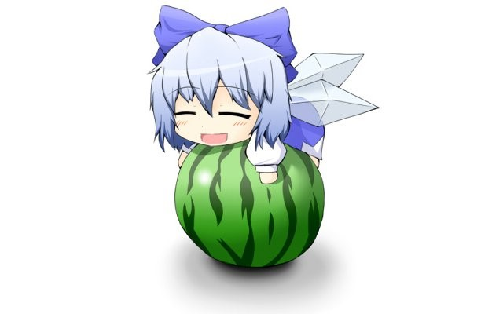

作业
-
------------
------------

百科解释概念
-

ASCII
-

ASCII（发音： /ˈæski/ ass-kee[1]，American Standard Code for Information Interchange，美国信息交换标准代码）是基于拉丁字母的一套计算机编码系统。它主要用于显示现代英语，而其扩展版本EASCII则可以部分支持其他西欧语言，并等同于国际标准ISO/IEC 646。
1968年版ASCII编码速见表

ASCII第一次以规范标准的类型发表是在1967年，最后一次更新则是在1986年，至今为止共定义了128个字符；其中33个字符无法显示（一些终端提供了扩展，使得这些字符可显示为诸如笑脸、扑克牌花式等8-bit符号），且这33个字符多数都已是陈废的控制字符。控制字符的用途主要是用来操控已经处理过的文字。在33个字符之外的是95个可显示的字符。用键盘敲下空白键所产生的空白字符也算1个可显示字符（显示为空白）。

color
-

颜色或色彩是通过眼、脑和我们的生活经验所产生的一种对光的视觉效应。人对颜色的感觉不仅仅由光的物理性质所决定，还包含心理等许多因素，比如人类对颜色的感觉往往受到周围颜色的影响。有时人们也将物质产生不同颜色的物理特性直接称为颜色。 

---------------------------

1
-
ASCII：0100 0001
Unicode：\u0041
uif-8：A

2
-
 (红255, 绿255, 蓝0) 

 3
 -
bmp 

jpg 

png 

tiff 

 tiff最好 
tiff是文档图像和文档管理系统中的标准格式，存储信息多，图形格式复杂 
png小质量、好P图、方便 
jpg是最流行的图片格式 
tiff压缩率22% 
png压缩率18% 
jpg压缩率4% 

4
-
有损压缩 
将文件变为“较小”的形式以利于传输或存储，并在另一方收到它后复原以便重新使用它。 
有损压缩 
程序直接去除“不必要”的信息，对文件进行剪裁以使它变得更小。这种类型的压缩大量应用于减小位图图像的文件大小，因为位图图像的体积通常非常庞大。 

------------------
------------------