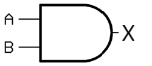
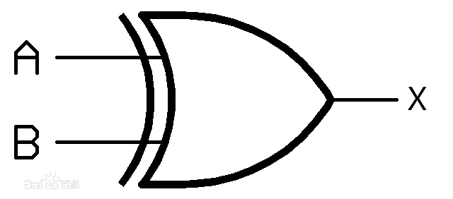
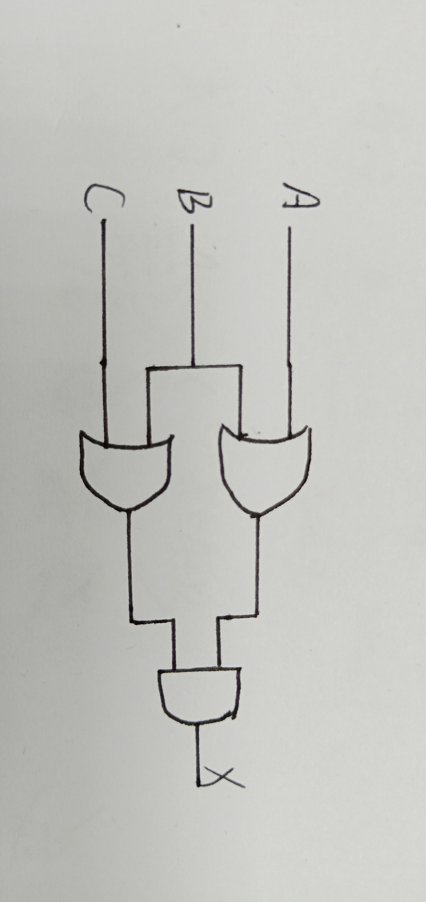

---
作业
---

part 1 of 2
-

----------------

1.与门
-
布尔表达式：X=A·B 
逻辑框图：    
真值表： 
|A|B|X|
|:-------------|:------------------|:------|
|0|0|0|
|0|1|0|
|1|0|0|
|1|1|1|

2.异或门
-
布尔表达式：X=A⊕B 
逻辑框图：
    
真值表： 
|A|B|X|
|:-------------|:------------------|:------|
0|0|0
0|1|1
1|0|1
1|1|0

3
-
 

4
-
|A|B|X|
|:-------------|:------------------|:------|
0|0|1
0|1|1
1|0|0
1|1|1

5
-
circuit equivalence 

That is, both circuits produce the exact same output for each input value combination

(AB)’ 的真值表 
|A|B|X|
|:-------------|:------------------|:------|
0|0|1
0|1|1
1|0|1
1|1|0
A’ + B’的真值表 
|A|B|X|
|:-------------|:------------------|:------|
0|0|1
0|1|1
1|0|1
1|1|0
所以(AB)’ = A’ + B’
