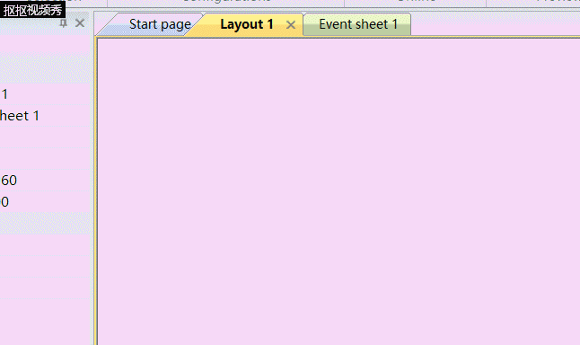
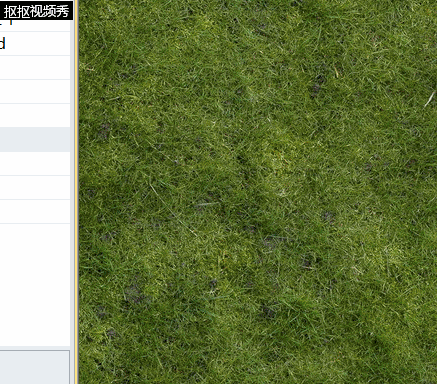
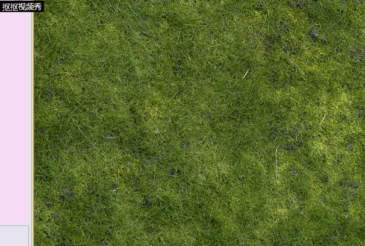
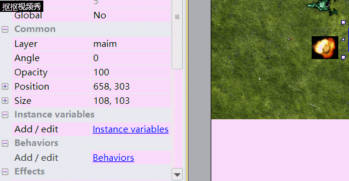
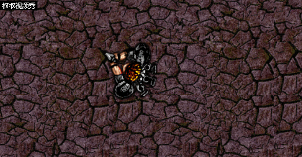
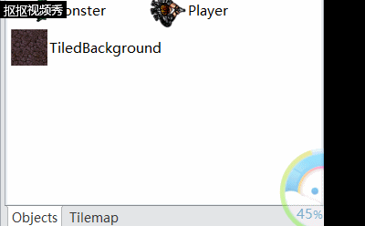
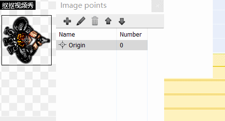
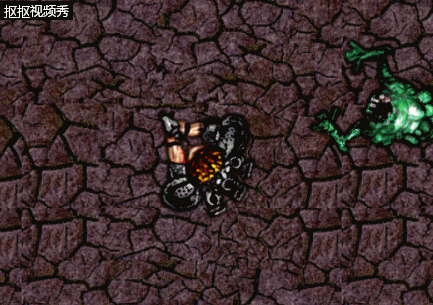
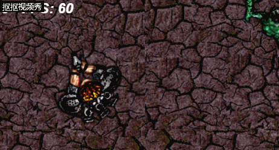

------
小白也能开发游戏
-
以Construct 2制作平台游戏的新手指南

------

 Construct 2 便是小白开发游戏最方便的软件，即使你是零CS（计算机）基础，也可以轻松地掌握Construct 2的游戏开发程序。并且整个过程不需要写代码哦！当然你如果有C语言基础，Cocos2d-X也是不错的选择。下面我来介绍以下如何用Construct 2来开发游戏。
 
 1.下载Construct 2 
 -
 只需要去官方网站下载就可以咯。如果你想使用完整版Construct 2或者你是土豪，欢迎到官网上购买尊贵版Construct 2。
 
 

 2.新建游戏项目
 -
 现在您已设置，启动Construct 2.单击File按钮，然后选择New。 
过程如图所示 

3.插入素材
-
可以提前先准备好需要的素材图片，如背景、玩家、子弹爆炸等 
插入背景如图所示 

插入其他素材如图所示 

4.添加行为
-
行为是游戏的重要部分，以下展示添加玩家行为的过程

同样也可以添加怪兽的行为，但我们需要将怪兽的移动速度减慢

其他人物的行为添加过程与此类似，便不再展示。

5.添加活动
-
对玩家添加set angle toward活动，我们就可以使总是对着鼠标，时刻准备射击 

不同的对象具有不同的条件和动作，这取决于它们可以做什么。还有System对象，它表示Construct 2的内置功能。 
如图 

6.添加游戏功能
-
运行游戏，惊讶地发现子弹是从玩家身体中间射出来的，这样就显得不真实。为了解决这些问题，增加游戏的真实生动性，便需要我们像下面这样添加游戏功能 

7.添加实例变量
-
我们游戏玩家刷怪来获得经验，虽然这种小游戏没有经验，但是想要个分数还是可以的。在此部分我们便来设置显示分数，当然前提是要设置生命和伤害 

8.创建抬头显示器（HUD）
-
这样我们就可以随时看见自己在游戏里的得分了

9.保存并运行
-
接下来就是最最后的保存和运行，快试试自己开发的游戏吧！ 

----------
到这里我们就已经成功开发了一个简单的游戏，Construct 2还有很多功能，可以开发出各种生动有趣的2D游戏。这里只是展示了她的基础功能。 
你学会使用Construct 2了吗？
----------
----------

