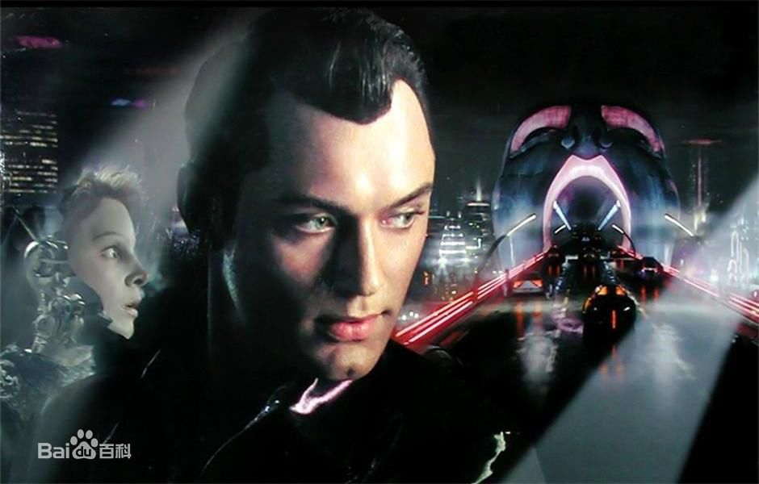
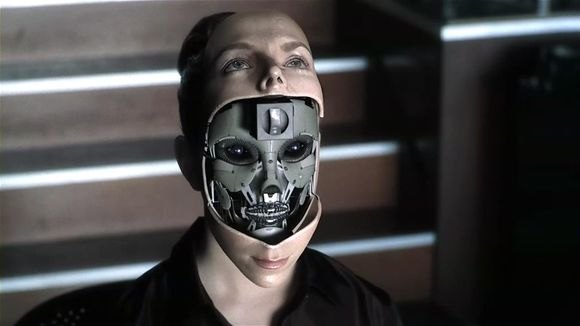
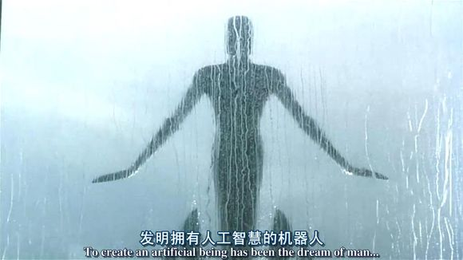
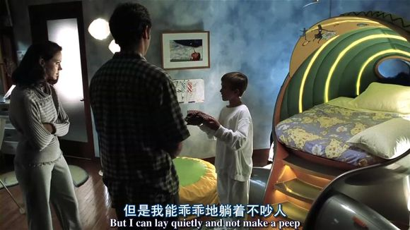
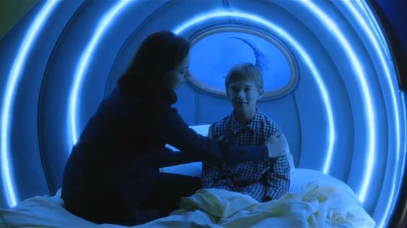
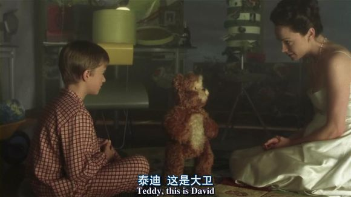

人工智能
-
---------------
2001最新的“实时3D电脑游戏引擎”系统被应用到一部电影中————人工智能 
作为21世纪的风口——人工智能，这部影片的名字就叫做人工智能，惊喜吧？ 

-----------------------------------
在机器人的发展过程中，赋予机器人以情感是最富有争议的，也是最后未能做到的事。 

通常机器人被视作为一个极其复杂的装置，人们认为他们不会具备感情 

但是，有很多父母失去了自己的孩子，时代的需要就使这种可能性大大增加了 
终于，Cybertronics Manufacturing制作公司着手解决了这个问题，制造出了第一个具有感情的机器人。 

他的名字叫大卫（海利·乔·奥斯蒙特饰），作为第一个被输入情感程序的机器男孩，大卫是这个公司的员工亨瑞和他的妻子的一个试验品，他们夫妻俩收养了大卫。 

而他们自己的孩子却最终因病被冷冻起来，以期待有朝一日，有一种能治疗这种病的方法会出现。 

尽管大卫逐渐成了他们的孩子，拥有了所有的爱，成为了家庭的一员。 

但是，一系列意想不到的事件的发生，使得大卫的生活无法进行下去。 
人类与机器最终都无法接受他，大卫只有唯一的一个伙伴机器泰迪——他的超级玩具泰迪熊，也是他的保护者。 
大卫开始踏上了旅程，去寻找真正属于自己的地方。 
他发现在那个世界中，机器人和机器之间的差距是那么的巨大，又是那么的脆弱。他要找寻自我、探索人性，成为一个真正意义上的人。 

------------------

快去看看你不会失望的，还是名导演制作的呢
