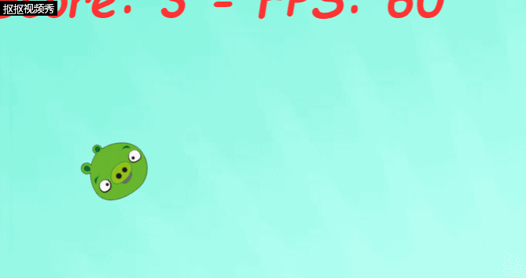
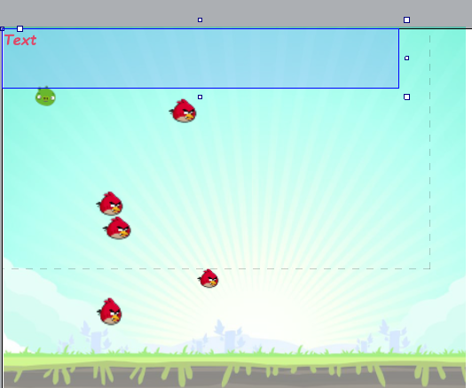
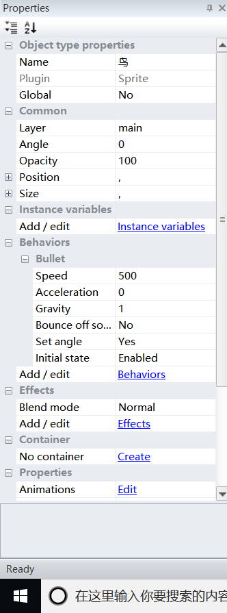
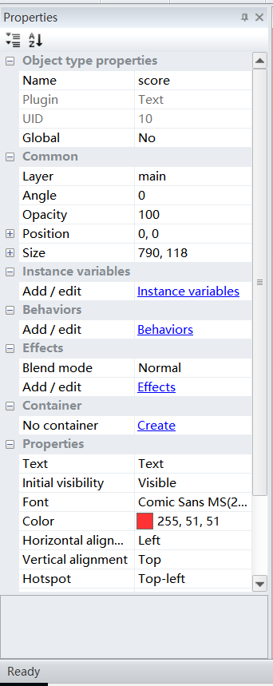
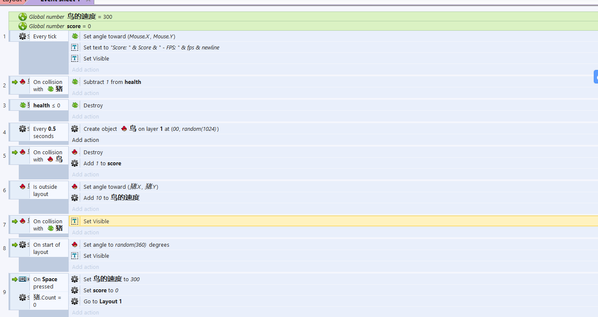

愤怒的小猪
-

## 游戏策划

<b>楔子(Setting)</b>：
愤怒的小鸟总是欺负小猪，小猪在渐渐变得聪明开始躲避攻击  
<b>玩法(Gameplay)</b>：
玩家使用上下左右方向键控制小猪，使小猪躲避小鸟的攻击。
当两只小鸟相撞时将获得1分，小猪被小鸟撞死，则游戏结束。 

## 成果展示 

## 游戏设计

####1、寻找素材

根据情景，寻找到小鸟、小猪、愤怒的小鸟背景等素材 
 

####2、设计内容

 
 
 
 

--------------
这样，愤怒的小鸟后续版便成功了，快来试试吧！