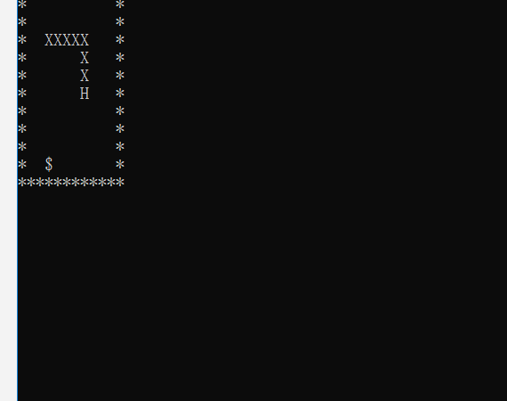

# [](#header-1)贪吃蛇游戏

-------------------------------

### [](#header-3)一、伪代码
我们用自顶向下的思路去考虑这个问题，先做一个可以在一定范围内通过键盘控制来移动的“蛇”。 
用伪代码来表示这个过程， 就是<br>
```
输出字符矩阵
    WHILE not 游戏结束 DO
        ch＝等待输入
        CASE ch DO
        ‘A’:左前进一步，break 
        ‘D’:右前进一步，break    
        ‘W’:上前进一步，break    
        ‘S’:下前进一步，break    
        END CASE
        输出字符矩阵
    END WHILE
    输出 Game Over!!! 
``` 
    
### [](#header-3)二、分析

1.总控（main）代码
```
    int main()
    {
        while (snakeLive)
        {
            Sleep(300);//设置速度
            system("cls");//清空屏幕
            put_food();//设置食物
            printmap();//输出字符矩阵
            snakeMove();//蛇向前进
            put_food();//判断食物是否被吃
            createNewArray();//当蛇身变长后创建新的X、Y坐标数组
        }
        return 0;
    }
```
2.程序的开始
```
    #include<stdio.h>
    #include<windows.h>
    #include<stdlib.h>
    #include<time.h>
    #include<string.h>
    #include<conio.h>
```
3.数据的定义
```
    #define SNAKE_MAX_LENGTH 20
    #define SNAKE_HEAD 'H'
    #define SNAKE_BODY 'X'
    #define BLANK_CELL ' '
    #define SNAKE_FOOD '$'
    #define WALL_CELL '*'
```
4.游戏的界面
```
    char map[12][13] =
    { "************",
    "*XXXXH     *",
    "*          *",
    "*          *",
    "*          *",
    "*          *",
    "*          *",
    "*          *",
    "*          *",
    "*          *",
    "*          *",
    "************" };
```
5.[蛇移动](snake_move.c)<br>
6.[蛇吃](snake_eat.c)<br>
7.演示<br>

    
    
### [](#header-3)三、源代码
    
    ```
    #include<stdio.h>
    #include<windows.h>
    #include<stdlib.h>
    #include<time.h>
    #include<string.h>
    #include<conio.h>

    #define SNAKE_MAX_LENGTH 20
    #define SNAKE_HEAD 'H'
    #define SNAKE_BODY 'X'
    #define BLANK_CELL ' '
    #define SNAKE_FOOD '$'
    #define WALL_CELL '*'

    void snakeMove(void);//蛇的移动（游戏主体）
    void put_food(void);//随机在maps中生成food,并判断food是否被吃
    void printmap(void);//打印屏幕
    void gameover(void);//当蛇头撞墙或者撞到身体时游戏结束
    void createNewArray(void);//当蛇身变长后创建新的X、Y坐标数组

    char map[12][13] =
    { "************",
    "*XXXXH     *",
    "*          *",
    "*          *",
    "*          *",
    "*          *",
    "*          *",
    "*          *",
    "*          *",
    "*          *",
    "*          *",
    "************" };

    int snakeX[SNAKE_MAX_LENGTH] = { 1,2,3,4,5 };//蛇身的横坐标
    int snakeY[SNAKE_MAX_LENGTH] = { 1,1,1,1,1 };//蛇身的纵坐标
    int snakeLength = 5;//蛇的初始长度
    int snakeLive = 1;//蛇的生命
    int foodYes = 1;//是否需要重新生成事物
    int foodX, foodY;//事物的横纵坐标
    char dir = 'd';//定义方向
    int lenthchange = 0;//判断是否需要更改蛇身坐标数组长度
    int tempX, tempY;//临时变量，当蛇变长时储存蛇尾坐标

    int main()
    {
        while (snakeLive)
        {
            Sleep(300);//设置速度
            system("cls");//清空屏幕
            put_food();//设置食物
            printmap();//输出字符矩阵
            snakeMove();//蛇向前进
            put_food();//判断食物是否被吃
            createNewArray();//当蛇身变长后创建新的X、Y坐标数组
        }
        return 0;
    }

    void snakeMove(void)
    {
        int i;
        if (_kbhit())//检测键盘是否有敲击
        {
            dir = _getch();
        }
        tempX = snakeX[0];//储存蛇尾坐标，在蛇身增长时需要用到
        tempY = snakeY[0];
        map[snakeY[0]][snakeX[0]] = BLANK_CELL;//把蛇尾变为空格
        for (i = 0; i < snakeLength - 1; i++)//蛇身往前移动
        {
            snakeX[i] = snakeX[i + 1];
            snakeY[i] = snakeY[i + 1];
            map[snakeY[i]][snakeX[i]] = SNAKE_BODY;
        }
        switch (dir)
        {
            case 'w':
            case 'W':snakeY[snakeLength - 1]--; break;//蛇头向上转
            case 'a':
            case 'A':snakeX[snakeLength - 1]--; break;//蛇头向左转
            case 's':
            case 'S':snakeY[snakeLength - 1]++; break;//蛇头向下转
            case 'd':
            case 'D':snakeX[snakeLength - 1]++; break;//蛇头向右转
        }
        gameover();//判断此时蛇头位置，若是碰到边缘或者是蛇身就停止
        map[snakeY[snakeLength - 1]][snakeX[snakeLength - 1]] = SNAKE_HEAD;//蛇头移动
    }

    void printmap(void)
    {
        int i, j;
        for (i = 0; i<12; i++)
        {
            for (j = 0; j < 12; j++)
                printf("%c", map[i][j]);
            printf("\n");
        }
    }

    void gameover(void)
    {
        if ((snakeY[snakeLength - 1] == 0 || snakeY[snakeLength - 1] == 11) || (snakeX[snakeLength - 1] == 0 || snakeX[snakeLength - 1] == 11))
        {
            printf("Game Over!\n");
            snakeLive--;
        }
        else if (map[snakeY[snakeLength - 1]][snakeX[snakeLength - 1]] == SNAKE_BODY)
        {
            printf("Game Over!\n");
            snakeLive--;
        }
    }

    void put_food(void)
    {
        srand(time(NULL));
        if (foodYes == 1)
        {
            foodX = rand() % 10 + 1;
            foodY = rand() % 10 + 1;
            while ((map[foodY][foodX] == SNAKE_BODY) || (map[foodY][foodX] == SNAKE_HEAD))
            {
                foodX = rand() % 10 + 1;
                foodY = rand() % 10 + 1;
            }
            map[foodY][foodX] = SNAKE_FOOD;
            foodYes = 0;
        }
        if (map[foodY][foodX] != SNAKE_FOOD)
        {
            if (snakeLength < SNAKE_MAX_LENGTH)
            {
                snakeLength++;
                lenthchange = 1;
            }
            foodYes = 1;
        }
    }

    void createNewArray(void)
    {
        int i;
        if (lenthchange == 1)
        {
            for (i = snakeLength - 1; i > 0; i--)
            {
                snakeX[i] = snakeX[i - 1];
                snakeY[i] = snakeY[i - 1];
            }
            map[snakeY[snakeLength - 1]][snakeX[snakeLength - 1]] = SNAKE_HEAD;
            snakeX[0] = tempX;
            snakeY[0] = tempY;
            for (i = 0; i < snakeLength - 1; i++)
                map[snakeY[i]][snakeX[i]] = SNAKE_BODY;
            lenthchange = 0;
        }
    }
    ```